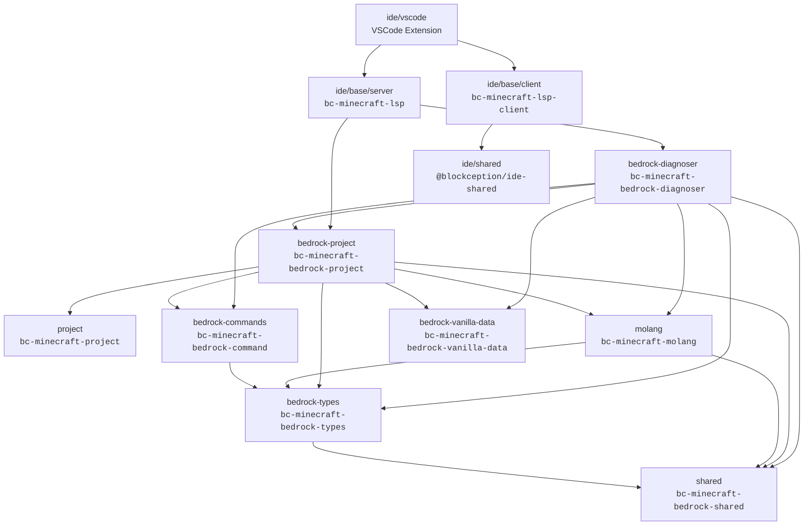

# Architecture

A high-level overview of how the packages in this monorepo relate to each other and how the Language Server Protocol (LSP) server is composed.

---

## Table of Contents

- [Package Dependency Graph](#package-dependency-graph)
- [LSP Server Composition](#lsp-server-composition)
- [Data Flow](#data-flow)
- [How-To: Adding a New Pack Type](#how-to-adding-a-new-pack-type)
- [How-To: Adding a New Diagnostic Rule](#how-to-adding-a-new-diagnostic-rule)

---

## Package Dependency Graph

Arrows represent "depends on" relationships (e.g., `bedrock-types --> shared` means `bedrock-types` depends on `shared`).



### Package Responsibilities

| Package | npm name | Purpose |
|---------|----------|---------|
| `packages/shared` | `bc-minecraft-bedrock-shared` | Shared utilities: glob matching, JSON parsing helpers, common types |
| `packages/project` | `bc-minecraft-project` | Generic project framework: `.mcignore`, `.mcattributes`, project discovery |
| `packages/bedrock-types` | `bc-minecraft-bedrock-types` | TypeScript interfaces and type definitions for all Bedrock concepts |
| `packages/bedrock-commands` | `bc-minecraft-bedrock-command` | Command parsing and validation for `.mcfunction` files |
| `packages/molang` | `bc-minecraft-molang` | Molang expression parsing, validation, and completion |
| `packages/bedrock-vanilla-data` | `bc-minecraft-bedrock-vanilla-data` | Static vanilla Minecraft data (blocks, items, entities, effects, …) |
| `packages/bedrock-project` | `bc-minecraft-bedrock-project` | Reads and parses Bedrock project files into an in-memory data model |
| `packages/bedrock-diagnoser` | `bc-minecraft-bedrock-diagnoser` | Diagnostic engine: 70+ rule categories across behavior packs, resource packs, and general validation |
| `ide/shared` | `@blockception/ide-shared` | Shared interfaces for IDE integrations (client ↔ server protocol extensions) |
| `ide/base/server` | `bc-minecraft-lsp` | Full LSP server implementation — all language features, processors, and services |
| `ide/base/client` | `bc-minecraft-lsp-client` | LSP client wrapper, handles server lifecycle inside an IDE |
| `ide/vscode` | _(VSCode extension)_ | Bundles the client and server into the VSCode extension entry point |

---

## LSP Server Composition

`setupServer` in `ide/base/server/src/lsp/server/setup.ts` wires together every component:

```
┌─────────────────────────────────────────────────────────────────────┐
│  setupServer(config)                                                │
│                                                                     │
│  connection ──► ExtensionContext ──► ServiceManager                 │
│                      │                                              │
│                      ├── DocumentManager   (tracks open documents)  │
│                      └── Database          (ProjectData cache)      │
│                                                                     │
│  Processor chain (each depends on the next):                        │
│    WorkspaceProcessor                                               │
│      └── PackProcessor                                              │
│            └── DocumentProcessor                                    │
│                  └── DiagnoserService ──► Diagnoser (from           │
│                                           bedrock-diagnoser)        │
│                                                                     │
│  Feature services (all registered with ServiceManager):             │
│    ConfigurationService   CodeActionService    CodeLensService       │
│    CommandService         CompletionService    DefinitionService     │
│    DocumentSymbolService  FormatService        ImplementationService │
│    ReferenceService       SemanticsServer      SignatureService      │
│    TypeDefinitionService  WorkspaceSymbolService  DataSetService     │
└─────────────────────────────────────────────────────────────────────┘
```

**Processor responsibilities:**

| Component | Responsibility |
|-----------|---------------|
| `WorkspaceProcessor` | Listens for workspace-level events; iterates workspace folders and delegates to `PackProcessor` |
| `PackProcessor` | Discovers packs via manifests; iterates all files in a pack and delegates to `DocumentProcessor` |
| `DocumentProcessor` | Hooks `onDidOpen` / `onDidSave`; calls `ProjectData.process()` then `DiagnoserService.diagnose()` |
| `DiagnoserService` | Bridges the LSP layer to the `Diagnoser` from `bedrock-diagnoser`; calls `connection.sendDiagnostics()` |

---

## Data Flow

The full path from a file save to diagnostics appearing in the editor:

```
User saves file
      │
      ▼
documents.onDidSave (DocumentManager)
      │
      ▼
DocumentProcessor.onDocumentChanged(e)
      │
      ├──► DocumentProcessor.process(doc)
      │         │
      │         ▼
      │    Glob.isMatch() check against .mcignore patterns
      │         │
      │         ▼ (file is not ignored)
      │    database.ProjectData.process(doc)
      │         │
      │         ▼
      │    PackType.detect(doc.uri)  ──────────────┐
      │         │                                  │
      │         ▼ (e.g. behavior_pack)             │ (resource_pack / world / …)
      │    behaviorPacks.process(doc)              └─► equivalent collection
      │    + extra preprocessing for commands
      │
      └──► DocumentProcessor.diagnose(doc)
                │
                ▼
          DiagnoserService.diagnose(doc)
                │
                │  (skipped if workspace not yet fully traversed)
                ▼
          Diagnoser.process(doc)  [bedrock-diagnoser]
                │
                ▼
          PackType.detect(doc.uri)
                │
                ├── behavior_pack ──► BehaviorPack.diagnose_document(diagnoser)
                ├── resource_pack ──► ResourcePack.diagnose_document(diagnoser)
                ├── skin_pack     ──► SkinPack.diagnose_document(diagnoser)
                └── world         ──► WorldPack.diagnose_document(diagnoser)
                          │
                          ▼
                    diagnoser.done()
                          │
                          ▼
                    InternalContext fires onDiagnosingFinished
                          │
                          ▼
                    DiagnoserService.set(doc, diagnostics)
                          │
                          ▼
                    connection.sendDiagnostics({ uri, diagnostics })
                          │
                          ▼
                    Diagnostics appear in the editor ✓
```

---

## How-To: Adding a New Pack Type

Follow these steps to introduce a new first-class pack type (e.g., `addon_pack`).

### 1. Register the pack type

**`packages/bedrock-project/src/project/pack-type.ts`**

```typescript
export enum PackType {
  resource_pack,
  behavior_pack,
  skin_pack,
  world,
  addon_pack,   // ← add new value
  unknown,
}

export namespace PackType {
  // Add a detection regex for the new pack's folder-name convention
  export const AddonPackMatch: RegExp = /[/\\].*(addon([ _-]|)pack|ap).*[/\\]/i;

  export function detect(uri: string): PackType {
    if (BehaviorPackMatch.test(uri)) return PackType.behavior_pack;
    if (ResourcePackMatch.test(uri)) return PackType.resource_pack;
    if (WorldMatch.test(uri))        return PackType.world;
    if (SkinPack.test(uri))          return PackType.skin_pack;
    if (AddonPackMatch.test(uri))    return PackType.addon_pack;   // ← add here
    return PackType.unknown;
  }
}
```

### 2. Create the pack data model

Mirror an existing collection (e.g., `packages/bedrock-project/src/project/resource-pack/`) to create:

```
packages/bedrock-project/src/project/addon-pack/
  addon-pack.ts             # Pack class implementing Pack interface
  addon-pack-collection.ts  # Collection class with add() / process() / delete()
  index.ts                  # Re-exports
```

### 3. Wire the pack into `ProjectData`

**`packages/bedrock-project/src/project/project-data.ts`**

```typescript
export class ProjectData {
  // Add the new collection
  addonPacks: AddonPackCollection = new AddonPackCollection();

  process(doc: TextDocument): DataSetBase | undefined {
    switch (PackType.detect(doc.uri)) {
      // ...existing cases...
      case PackType.addon_pack:
        return this.addonPacks.process(doc);   // ← add case
    }
  }

  addPack(manifest: string, project: MCProject): Pack | undefined {
    switch (types) {
      // ...existing cases...
      case PackType.addon_pack:
        return this.addonPacks.add(parent, context, effectiveManifest);  // ← add case
    }
  }
}
```

### 4. Add diagnostics for the new pack type

Create a diagnostic entry-point:

```
packages/bedrock-diagnoser/src/diagnostics/addon-pack/
  addon-pack.ts   # Export diagnose_document(diagnoser) function
  index.ts
```

Then register the dispatch in **`packages/bedrock-diagnoser/src/types/diagnoser.ts`**:

```typescript
switch (pack.type) {
  // ...existing cases...
  case PackType.addon_pack:
    out = AddonPack.diagnose_document(diagnoser);   // ← add case
    break;
}
```

### 5. Update `PackProcessor.remove()`

**`ide/base/server/src/lsp/process/pack-processor.ts`**

```typescript
remove(pack: Pack) {
  const pd = this.extension.database.ProjectData;
  pd.deleteFolder(pack.folder);

  this.removePack(pd.behaviorPacks.packs, pack.folder, pd.behaviorPacks.delete);
  this.removePack(pd.resourcePacks.packs, pack.folder, pd.resourcePacks.delete);
  this.removePack(pd.worlds.packs,        pack.folder, pd.worlds.delete);
  this.removePack(pd.addonPacks.packs,    pack.folder, pd.addonPacks.delete);  // ← add
}
```

### 6. Update completion and hover providers (if required)

Completion providers that switch on `PackType` (e.g., in `ide/base/server/src/lsp/completion/`) may need new cases for the new pack type.

---

## How-To: Adding a New Diagnostic Rule

> For a detailed reference with examples see [Creating Diagnostics](./guides/creating-diagnostics.md).

### Quick steps

#### 1. Choose the right directory

| Rule type | Directory |
|-----------|-----------|
| Behavior pack | `packages/bedrock-diagnoser/src/diagnostics/behavior-pack/` |
| Resource pack | `packages/bedrock-diagnoser/src/diagnostics/resource-pack/` |
| Generic validation | `packages/bedrock-diagnoser/src/diagnostics/general/` |
| Minecraft concepts | `packages/bedrock-diagnoser/src/diagnostics/minecraft/` |
| Molang | `packages/bedrock-diagnoser/src/diagnostics/molang/` |

#### 2. Write the diagnostic function

```typescript
// packages/bedrock-diagnoser/src/diagnostics/behavior-pack/entity/my-check.ts
import { DiagnosticsBuilder, DiagnosticSeverity } from '../../../types';

export function diagnose_my_check(value: string, diagnoser: DiagnosticsBuilder): void {
  if (isValid(value)) return;

  diagnoser.add(
    value,
    `Cannot find my-resource: ${value}`,
    DiagnosticSeverity.error,
    'behaviorpack.entity.my_resource.missing',  // follows category.subcategory.type.detail
  );
}
```

#### 3. Call it from the appropriate `diagnose_document` function

Find the `diagnose_document` function for the relevant file type (e.g., `entity.ts`) and add a call to your new function.

#### 4. Follow the naming convention

```
<category>.<subcategory>.<type>.<detail>
```

Common suffixes: `.missing`, `.invalid`, `.deprecated`, `.minimum`, `.maximum`, `.duplicate`

#### 5. Write a test

```typescript
// packages/bedrock-diagnoser/test/diagnostics/behavior-pack/entity/my-check.test.ts
import { TestDiagnoser } from '../../../../diagnoser';

describe('my-check', () => {
  it('reports an error for a missing resource', () => {
    const diagnoser = TestDiagnoser.createDocument(/* ... */);
    diagnose_my_check('nonexistent_id', diagnoser);
    expect(diagnoser.count('behaviorpack.entity.my_resource.missing')).toBe(1);
  });
});
```

Run with:

```bash
npm test --workspace=packages/bedrock-diagnoser
```
