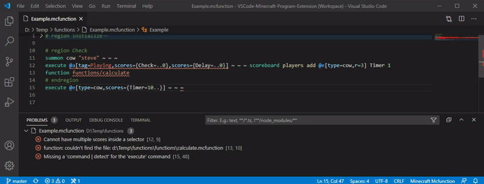

# Resources

This folder contains images, assets, and other media files used in the documentation.

## Contents

- `overview.gif` - Overview animation showing the language server features

## Usage in Documentation

Resources in this folder can be referenced in documentation files using relative paths:

```markdown

```

Or from other folders:

```markdown

```

## Contributing Resources

When adding new resources:

1. **Use descriptive names** - Name files clearly (e.g., `completion-demo.gif`, `entity-validation.png`)
2. **Optimize file sizes** - Compress images to keep the repository size reasonable
3. **Use appropriate formats**:
   - `.png` for screenshots with text or sharp edges
   - `.jpg` for photos
   - `.gif` for short animations
   - `.svg` for diagrams and icons (when possible)
4. **Update this README** - Add new files to the contents list above
5. **Reference in documentation** - Make sure to use the resource in relevant documentation

## Image Guidelines

- **Screenshots**: Should be clear and focused on the relevant feature
- **Animations**: Keep under 5MB when possible, show key interactions
- **Diagrams**: Use simple, clear visuals that complement the text
- **Resolution**: Use appropriate resolution (high enough to be clear, but not unnecessarily large)

## Tools

Recommended tools for creating documentation resources:

- **Screenshots**: Built-in OS tools, ShareX (Windows), Flameshot (Linux)
- **GIF recording**: ScreenToGif, LICEcap, Peek
- **Image optimization**: TinyPNG, ImageOptim, pngquant
- **Diagrams**: Draw.io, Excalidraw, Mermaid

## Related Documentation

- [Main Documentation](../) - All documentation files
- [Contributing Guide](../../CONTRIBUTING.md) - General contribution guidelines
